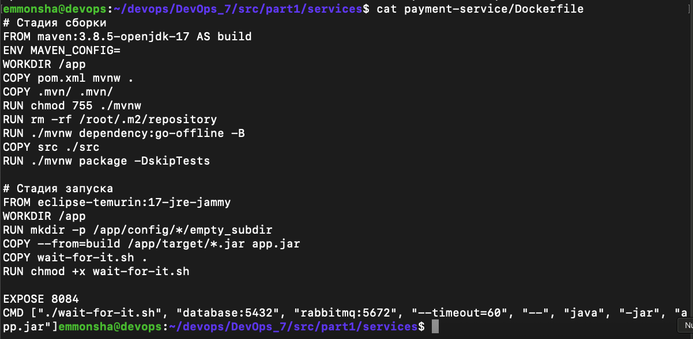
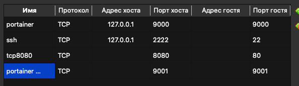

## Part 1. Запуск нескольких Docker-контейнеров с использованием Docker Compose

Создаем Dockerfile для каждого микросервиса, расположенного в папке services

В папке materials есть небольшая подсказка по проекту. Будем работать с ним. </br>
После подготовки окружения (установкa docker, docker-compose)
Начну с двух первых сервисов: 
- rabbitmq;
- postgresql. 

******
## **_rabbitmq_**

Для rabbitmq лучше всего использовать стандартный образ, так как никакой дополнительной настройки не потребуется (например, `rabbitmq:3-management-alpine`).
С официального сайта `https://hub.docker.com/_/rabbitmq` получим последний образ и Dockerfile для него </br>

```
#
# NOTE: THIS DOCKERFILE IS GENERATED VIA "apply-templates.sh"
#
# PLEASE DO NOT EDIT IT DIRECTLY.
#

FROM rabbitmq:4.1-alpine

RUN set -eux; \
	rabbitmq-plugins enable --offline rabbitmq_management; \
# make sure the metrics collector is re-enabled (disabled in the base image for Prometheus-style metrics by default)
	rm -f /etc/rabbitmq/conf.d/20-management_agent.disable_metrics_collector.conf; \
# grab "rabbitmqadmin" from inside the "rabbitmq_management-X.Y.Z" plugin folder
# see https://github.com/docker-library/rabbitmq/issues/207
	cp /plugins/rabbitmq_management-*/priv/www/cli/rabbitmqadmin /usr/local/bin/rabbitmqadmin; \
	[ -s /usr/local/bin/rabbitmqadmin ]; \
	chmod +x /usr/local/bin/rabbitmqadmin; \
	apk add --no-cache python3; \
	rabbitmqadmin --version

EXPOSE 15671 15672
```
изменяю порты с 15671 15672 на 5671 5672 </br>

 
Создаю файл docker-compose и делаю запись для этого сервиса. Создаю сеть docker7 для проекта в docker-compose.yml.
```
services:
  rabbitmq:
    build: ./rabbitmq
    ports:
      - "5672:5672"  # AMQP
      - "15672:15672"  # Web UI
    networks:
      - devops7
networks:  # внутренняя сеть для всего проекта
  devops7:
    driver: bridge
```


 </br>
проверяю создается ли образ и контейнер 
```
docker-compose up --build -d rabbitmq
docker images
docker ps
```
 <br>
 <br>
 <br>

******
## **_database_**
Теперь сделаю Dockerfile для базы данных 
в папке `/database/Dockerfile` 

```
#database/Dockerfile
# беру официальный образ PostgreSQL
FROM postgres:latest
# инициализирую базу данных
COPY init.sql /docker-entrypoint-initdb.d/
# Даю права  (Alpine требует явного указания)
RUN chmod 644 /docker-entrypoint-initdb.d/init.sql
# Открываю порт 5432 для подключения к базе данных
EXPOSE 5432
```
 </br>
Добавлю необходимые строки в docker-compose,
кроме этого создам внутреннюю сеть docker и общее пространство для работы с базами
все переменные буду включать в docker-compose.yml так как их проще менять без пересборки образа, если их указать в Dockerfile нужно будет пересобирать образ, что-бы их поменять. </br>

```
    database:
    build: ./database
    environment:
      # Задаем переменные окружения для базы данных
      - POSTGRES_USER=postgres
      - POSTGRES_PASSWORD=master
      - POSTGRES_MULTIPLE_DATABASES="users_db,hotels_db,reservations_db,payments_db,balances_db,statistics_db"
    ports:
       - "5432:5432"
    volumes:
       - postgres_data:/var/lib/postgresql/data
    networks:
       - devops7

volumes:
  postgres_data:

networks:
  devops7:
    driver: bridge
```
</br>  </br>

Создаю образ и запускаю контейнер с базой данных.
```
docker-compose up --build -d database
docker images
docker ps </br>
```
</br>  </br>
</br>  </br>
</br>  </br>

проверяю работает ли база данных, сведения о созданных базах можно увидеть в файле init.sql
</br> 

вижу ответ, следовательно, моя база запущена и создан пользователь postgres
</br>

******
## **_session-service_**

Создаю `/session/Dockerfile` для сервиса `session-service`. Нужно отметить, что столкнулся с ошибкой, которая возникала из-за неправинлього определения переменной MAVEN_CONFIG </br>
 </br>
 </br>
В итоге, решил проблему заново переопределив эту переменную в Dockerfile и задав ей пустое значение

```
# Стадия сборки
FROM maven:3.8.5-openjdk-17 AS build
ENV MAVEN_CONFIG=
WORKDIR /app
COPY pom.xml mvnw .
COPY .mvn/ .mvn/
RUN chmod 755 ./mvnw
RUN rm -rf /root/.m2/repository
RUN ./mvnw dependency:go-offline -B
COPY src ./src
RUN ./mvnw package -DskipTests

# Стадия запуска
FROM eclipse-temurin:17-jre-jammy
WORKDIR /app
COPY --from=build /app/target/*.jar app.jar
COPY wait-for-it.sh .
RUN chmod +x wait-for-it.sh

EXPOSE 8081
CMD ["./wait-for-it.sh", "database:5432", "rabbitmq:5672", "--timeout=60", "--", "java", "-jar", "app.jar"]
``` 
 </br>


Вножу запись в docker-compose.yml
```
  session-service:
    build: ./session-service
    environment:
      - POSTGRES_HOST=database
      - POSTGRES_PORT=5432
      - POSTGRES_USER=postgres
      - POSTGRES_PASSWORD=master
      - POSTGRES_DB=users_db
    networks:
      - devops7
    ports:
      - "8081:8081"
```
 </br>

Создаю образ и запускаю контейнер с сервисом.
```
docker-compose up --build -в session-service
docker images
docker ps
```
 </br>
 </br>
 </br>

Проверяю подключился ли сервис к базе данных </br>
 </br>

Получаю ответ. Вижу, что подключение создано, дополнительно проверяю версию java </br>  
 </br>


******
## **_hotel-service_**

Для сервиса `hotel-service` также сделаю Dockerfile
```
# hotel-service/Dockerfile 
# Стадия сборки
FROM maven:3.8.5-openjdk-17 AS build
# Сбрасываем MAVEN_CONFIG, чтобы избежать конфликта с mvnw
ENV MAVEN_CONFIG=
WORKDIR /app
COPY pom.xml mvnw .
COPY .mvn/ .mvn/
RUN chmod 755 ./mvnw
RUN rm -rf /root/.m2/repository
# Загрузка зависимостей (без MAVEN_CONFIG=/root/.m2)
RUN ./mvnw dependency:go-offline -B
COPY src ./src
RUN ./mvnw package -DskipTests

# Стадия запуска
FROM eclipse-temurin:17-jre-jammy
WORKDIR /app
COPY --from=build /app/target/*.jar app.jar
COPY wait-for-it.sh .
RUN chmod +x wait-for-it.sh

EXPOSE 8082
CMD ["./wait-for-it.sh", "database:5432", "rabbitmq:5672", "--timeout=60", "--", "java", "-jar", "app.jar"]

```
  </br>

Делаю запись в docker-compose.yml 
```
  hotel-service:
    build: ./hotel-service
    environment:
      - POSTGRES_HOST=database
      - POSTGRES_PORT=5432
      - POSTGRES_USER=postgres
      - POSTGRES_PASSWORD=master
      - POSTGRES_DB=hotels_db
    networks:
      - devops7
    ports:
      - "8082:8082"
```

 </br>

Создаю образ и запускаю контейнер с сервисом. Проверяю его создание и проверяю запущен ли JDK. </br>
```
docker-compose up --build -в hotel-service
docker images
docker ps
```
 </br>
 </br>
 </br>

Проверяю версию java</br>

 </br>

******
## **_booking-service_**

Создаю Dockerfile для `booking-service`. При работе с этим сервисом столкнулся с ошибкой </br> 
SpringApplication требовала наличие субдиректорий в папке config/*/. Решили ошибку костылем, взял решение в интернете на stackoverflow путем добавления рандомной субдиректории Директивой `RUN mkdir -p  /app/config/*/empty_subdir` в Dockerfile


```
# booking-service/Dockerfile
# Стадия сборки
FROM maven:3.8.5-openjdk-17 AS build
ENV MAVEN_CONFIG=
WORKDIR /app
COPY pom.xml mvnw .
COPY .mvn/ .mvn/
RUN chmod 755 ./mvnw
RUN rm -rf /root/.m2/repository
RUN ./mvnw dependency:go-offline -B
COPY src ./src
RUN ./mvnw package -DskipTests

# Стадия запуска
FROM eclipse-temurin:17-jre-jammy
WORKDIR /app
RUN mkdir -p /app/config/*/empty_subdir
COPY --from=build /app/target/*.jar app.jar
COPY wait-for-it.sh .
RUN chmod +x wait-for-it.sh

EXPOSE 8083
CMD ["./wait-for-it.sh", "database:5432", "rabbitmq:5672", "--timeout=60", "--", "java", "-jar", "app.jar"]
```


```
  booking-service:
    build: ./booking-service
    environment:
      - POSTGRES_HOST=database
      - POSTGRES_PORT=5432
      - POSTGRES_USER=postgres
      - POSTGRES_PASSWORD=master
      - POSTGRES_DB=reservations_db
      - RABBIT_MQ_HOST=rabbitmq
      - RABBIT_MQ_PORT=5672
      - RABBIT_MQ_USER=postgres
      - RABBIT_MQ_PASSWORD=master
      - RABBIT_MQ_QUEUE_NAME=messagequeue
      - RABBIT_MQ_EXCHANGE=messagequeue-exchange
      - HOTEL_SERVICE_HOST=hotel-service
      - HOTEL_SERVICE_PORT=8082
      - PAYMENT_SERVICE_HOST=payment-service
      - PAYMENT_SERVICE_PORT=8084
      - LOYALTY_SERVICE_HOST=loyalty-service
      - LOYALTY_SERVICE_PORT=8085
    networks:
      - devops7
    ports:
      - "8083:8083"
```


Создаю образ и запускаю контейнер с сервисом. роверяю его создание и проверяю запущен ли JDK.
```
docker-compose up --build -в booking-service
docker images
docker ps
docker exec services_payment-service_1 java -version
```

 </br>
 </br>
 </br>
 </br>


******
## **_payment-service_**

`payment-service/Dockerfile`

```
# payment-service/Dockerfile
# Стадия сборки
FROM maven:3.8.5-openjdk-17 AS build
ENV MAVEN_CONFIG=
WORKDIR /app
COPY pom.xml mvnw .
COPY .mvn/ .mvn/
RUN chmod 755 ./mvnw
RUN rm -rf /root/.m2/repository
RUN ./mvnw dependency:go-offline -B
COPY src ./src
RUN ./mvnw package -DskipTests

# Стадия запуска
FROM eclipse-temurin:17-jre-jammy
WORKDIR /app
RUN mkdir -p /app/config/*/empty_subdir
COPY --from=build /app/target/*.jar app.jar
COPY wait-for-it.sh .
RUN chmod +x wait-for-it.sh

EXPOSE 8084
CMD ["./wait-for-it.sh", "database:5432", "rabbitmq:5672", "--timeout=60", "--", "java", "-jar", "app.jar"]
```



`docker-compose.yml`

```
  payment-service:
    build: ./payment-service
    environment:
      - POSTGRES_HOST=database
      - POSTGRES_PORT=5432
      - POSTGRES_USER=postgres
      - POSTGRES_PASSWORD=master
      - POSTGRES_DB=payments_db
    networks:
      - devops7
    ports:
      - "8084:8084"
```
 </br>

Создаю образ и запускаю контейнер с сервисом, проверяю его создание и проверяю запущен ли JDK. </br>
```
docker-compose up --build -в payment-service
docker images
docker ps
docker exec services_payment-service_1 java -version
```
 </br>
 </br>
 </br>
 </br>

******
## **_loyalty-service_**

`loyalty-service/Dockerfile`

```
# Стадия сборки
FROM maven:3.8.5-openjdk-17 AS build
ENV MAVEN_CONFIG=
WORKDIR /app
COPY pom.xml mvnw .
COPY .mvn/ .mvn/
RUN chmod 755 ./mvnw
RUN rm -rf /root/.m2/repository
RUN ./mvnw dependency:go-offline -B
COPY src ./src
RUN ./mvnw package -DskipTests

# Стадия запуска
FROM eclipse-temurin:17-jre-jammy
WORKDIR /app
RUN mkdir -p /app/config/empty_subdir
COPY --from=build /app/target/*.jar app.jar
COPY src/main/resources/application* ./config/
COPY wait-for-it.sh .
RUN chmod +x wait-for-it.sh

EXPOSE 8085
CMD ["./wait-for-it.sh", "database:5432", "rabbitmq:5672", "--timeout=60", "--", "java", "-jar", "app.jar"]
```
 </br>
`docker-compose`
```
  loyalty-service:
    build: ./loyalty-service
    environment:
      - POSTGRES_HOST=database
      - POSTGRES_PORT=5432
      - POSTGRES_USER=postgres
      - POSTGRES_PASSWORD=master
      - POSTGRES_DB=balances_db
    networks:
      - devops7
    ports:
      - "8085:8085"
```
 </br>

Создаю образ и запускаю контейнер с сервисом, проверяю его создание и проверяю запущен ли JDK.
```
docker-compose up --build -в payment-service
docker images
docker ps
docker exec services_payment-service_1 java -version
```
 </br>
 </br>
 </br>
 </br>

******
## **_report-service_**

`report-service/Dockerfile`

```
# report-service/Dockerfile
# Стадия сборки
FROM maven:3.8.5-openjdk-17 AS build
ENV MAVEN_CONFIG=
WORKDIR /app
COPY pom.xml mvnw .
COPY .mvn/ .mvn/
RUN chmod 755 ./mvnw
RUN rm -rf /root/.m2/repository
RUN ./mvnw dependency:go-offline -B
COPY src ./src
RUN ./mvnw package -DskipTests

# Стадия запуска
FROM eclipse-temurin:17-jre-jammy
WORKDIR /app
RUN mkdir -p /app/config/*/empty_subdir
COPY --from=build /app/target/*.jar app.jar
COPY wait-for-it.sh .
RUN chmod +x wait-for-it.sh

EXPOSE 8086
CMD ["./wait-for-it.sh", "database:5432", "rabbitmq:5672", "--timeout=60", "--", "java", "-jar", "app.jar"]
```


`docker-compose.yml`

```
  report-service:
    build: ./report-service
    environment:
      - POSTGRES_HOST=database
      - POSTGRES_PORT=5432
      - POSTGRES_USER=postgres
      - POSTGRES_PASSWORD=master
      - POSTGRES_DB=statistics_db
      - RABBIT_MQ_HOST=rabbitmq
      - RABBIT_MQ_PORT=5672
      - RABBIT_MQ_USER=postgres
      - RABBIT_MQ_PASSWORD=master
      - RABBIT_MQ_QUEUE_NAME=messagequeue
      - RABBIT_MQ_EXCHANGE=messagequeue-exchange
    networks:
      - devops7
    ports:
      - "8086:8086"
```


Создаю образ и запускаю контейнер с сервисом, проверяю его создание и проверяю запущен ли JDK.
```
docker-compose up --build -в payment-service
docker images
docker ps
docker exec services_payment-service_1 java -version
```

 </br>
 </br>
 </br>
 </br>


******
## **_gateway-service_**

`gateway-service/Dockerfile`

```
# gateway-service/Dockerfile
# Стадия сборки
FROM maven:3.8.5-openjdk-17 AS build
ENV MAVEN_CONFIG=
WORKDIR /app
COPY pom.xml mvnw .
COPY .mvn/ .mvn/
RUN chmod 755 ./mvnw
RUN rm -rf /root/.m2/repository
RUN ./mvnw dependency:go-offline -B
COPY src ./src
RUN ./mvnw package -DskipTests

# Стадия запуска
FROM eclipse-temurin:17-jre-jammy
WORKDIR /app
RUN mkdir -p /app/config/*/empty_subdir
COPY --from=build /app/target/*.jar app.jar
COPY wait-for-it.sh .
RUN chmod +x wait-for-it.sh

EXPOSE 8087
CMD ["./wait-for-it.sh", "database:5432", "rabbitmq:5672", "--timeout=60", "--", "java", "-jar", "app.jar"]
```


`docker-compose.yml`
```
  gateway-service:
    build: ./gateway-service
    environment:
      - SESSION_SERVICE_HOST=session-service
      - SESSION_SERVICE_PORT=8081
      - HOTEL_SERVICE_HOST=hotel-service
      - HOTEL_SERVICE_PORT=8082
      - BOOKING_SERVICE_HOST=booking-service
      - BOOKING_SERVICE_PORT=8083
      - PAYMENT_SERVICE_HOST=payment-service
      - PAYMENT_SERVICE_PORT=8084
      - LOYALTY_SERVICE_HOST=loyalty-service
      - LOYALTY_SERVICE_PORT=8085
      - REPORT_SERVICE_HOST=report-service
      - REPORT_SERVICE_PORT=8086
    networks:
      - devops7
    ports:
      - "8087:8087"

```


Создаю образ и запускаю контейнер с сервисом, проверяю его создание и проверяю запущен ли JDK.
```
docker-compose up --build -в payment-service
docker images
docker ps
docker exec services_payment-service_1 java -version
```
 </br>
 </br>
 </br>
 </br>


******
## **Запуск всего проекта **

Проверяю собранные образы 

 </br>

```
docker-compose up -d
docker ps
```
 </br>
 </br>

Видно, что контейнеры запустились, работают стабильно. 
Приступаю к тестированию

******
## **Тестирование проекта **


Устанавливаю `Postman` и `Postman Agent` на машину. </br>

 </br>
 </br>
# **Postman**         </br>
# **Postman Agent**   </br>

В папке src лежит файл `application_tests.postman_collection.json`
Он нужен для проведения тестов
После регистрации в Postman, вхожу в панель тестирования, импортирую файл с тестами </br>
 </br>
Красным обозначена кнопка импорта, синим импортированные тесты. </br>

Провожу тестирование:

`GET login user` </br>
 </br>

`GET Get hotels` </br>
 </br>

`GET hotel` </br>
 </br>

`POST book hotel` </br>
 </br>

`GET user loyalty` </br>
 </br>

Все тесты прошли успешно на запросы пришли ответы 200 и 201.
На этом первая часть задания все, закончилась.

## Part 2. Создание виртуальных машин

Пришло время заготовить основу для будущих узлов кластера. Создадим виртуальную машину.

### Задание 

1) Установи и инициализируй Vagrant в корне проекта. Напиши Vagrantfile для одной виртуальной машины. Перенеси исходный код веб-сервиса в рабочую директорию виртуальной машины. Помощь по vagrant ты найдешь в материалах.

2) Зайди через консоль внутрь виртуальной машины и удостоверься, что исходный код встал, куда нужно. Останови и уничтожь виртуальную машину.


## Part 3. Создание простейшего Docker Swarm

### Задание

1) Модифицируй Vagrantfile для создания трех машин: manager01, worker01, worker02. Напиши shell-скрипты для установки Docker внутрь машин, инициализации и подключения к Docker Swarm. Помощь с Docker Swarm ты найдешь в материалах. 

</br>

`Vagrantfile` </br>

```
# -*- mode: ruby -*-
# vi: set ft=ruby :

nodes = [
  { :hostname => 'manager01', :ip => '192.168.77.10', :ram => 2048, :cpus => 1 },
  { :hostname => 'worker01', :ip => '192.168.77.12', :ram => 2048, :cpus => 1 },
  { :hostname => 'worker02', :ip => '192.168.77.13', :ram => 2048, :cpus => 1 }
]

Vagrant.configure("2") do |config|

  # vagrant-hostmanager options
  config.hostmanager.enabled = true
  config.hostmanager.manage_host = true
  config.hostmanager.manage_guest = true
  config.hostmanager.ignore_private_ip = false
  config.hostmanager.include_offline = false
  # Always use Vagrant's insecure key
  #config.ssh.insert_key = false
  # Forward ssh agent to easily ssh into the different machines
  config.ssh.forward_agent = true
  # Vagrant box
#   config.vm.box = "bento/ubuntu-18.04"
  config.vm.box = "hashicorp-education/ubuntu-24-04"
  config.vm.box_version = "0.1.0"
  # Docker
#   config.vm.provision "docker"
  # Synced Folder
  config.vm.synced_folder '.', '/vagrant'

  # Provision nodes
  nodes.each do |node|
    config.vm.define node[:hostname] do |config|
      config.vm.hostname = node[:hostname]
      config.vm.network :private_network, ip: node[:ip]

      memory = node[:ram] ? node[:ram] : 2048;
      cpus = node[:cpus] ? node[:cpus] : 2;

      config.vm.provider :virtualbox do |vb|
        vb.customize [
          "modifyvm", :id,
          "--memory", memory.to_s,
          "--cpus", cpus.to_s
        ]
      end 
      config.vm.provision :shell, path: "install.sh"

          # Provision manager01 using docker swarm init after the last VM is booted.
      if node[:hostname] == "manager01"
        config.vm.provision "shell", inline: <<-SHELL
          sudo timedatectl set-ntp true
          sudo usermod -aG docker $USER
          # sudo reboot
          docker swarm init --advertise-addr #{node[:ip]}:2377 --data-path-addr #{node[:ip]}
          echo "#{node[:ip]}" > /vagrant/manager01ip.txt
          docker swarm join-token -q worker > /vagrant/swarm_token.txt
          SHELL
      end

      if node[:hostname].start_with?("worker0")
        config.vm.provision "shell", inline: <<-SHELL
        sudo timedatectl set-ntp true
        sudo usermod -aG docker $USER
        MANAGER_IP=$(cat /vagrant/manager01ip.txt)
        WORKER_TOKEN=$(cat /vagrant/swarm_token.txt)  # Read from shared file
        echo "$WORKER_TOKEN"
        docker swarm join --advertise-addr #{node[:ip]} --listen-addr #{node[:ip]}:2377 --token $WORKER_TOKEN $MANAGER_IP:2377
        SHELL
      end
    end
  end
end
```
</br>

 </br>
 </br>

`install.sh`
```
#!/usr/bin/env bash

# ===============
# INSTALL DOCKER 
# ===============
export DEBIAN_FRONTEND=noninteractive
sudo apt-get update -y -qq
sudo apt-get install -y \
                ca-certificates \
                curl \
                gnupg \
                apt-transport-https \
                gnupg-agent \
                software-properties-common
 
sudo install -m 0755 -d /etc/apt/keyrings
curl -fsSL https://download.docker.com/linux/ubuntu/gpg | sudo gpg --dearmor -o /etc/apt/keyrings/docker.gpg
echo \
      "deb [arch="$(dpkg --print-architecture)" signed-by=/etc/apt/keyrings/docker.gpg] https://download.docker.com/linux/ubuntu \
      "$(. /etc/os-release && echo "$VERSION_CODENAME")" stable" | \
      sudo tee /etc/apt/sources.list.d/docker.list > /dev/null

echo "update 2"
sudo apt-get update -y -qq
sudo apt-get install -y -qq docker-ce \
                docker-ce-cli \
                containerd.io \
                docker-buildx-plugin \
                docker-compose-plugin
# sudo usermod -aG docker $USER
# sudo reboot  # Refresh group permissions

if docker --version; then 
    echo "✅ Docker installed!"
else
    echo "❌ Docker installation failed!"
    exit 1
fi

```

 </br>

2) Загрузи собранные образы на Docker Hub и модифицируй Docker Compose файл для подгрузки расположенных на Docker Hub образов.

После регистрации в docker hub, генерирую свой персональный ключ доступа </br>
 </br>
 </br>
 </br>
 </br>
После создания ключа, регистрирую свой докер в docker hub </br>
 </br>
Далее создаю новый репозиторий <br> 
 </br>
Проверяю образы для загрузки на docker hub </br>
 </br>
 </br>
после загрузки всех образов проверяю их создание в docker hub </br>
 <br>

3) Подними виртуальные машины и перенеси на менеджер Docker Compose файл. Запусти стек сервисов, используя написанный Docker Compose файл.

Поднимаю виртуальные машины, но сталкиваюсь с ошибкой </br>
 </br>
устанавливвю недостающий плагин </br>
 </br>
Заново развертываю машины </br>
 </br>
После развертывания проверяю статус машин </br>
 </br>
Все требуемые машины созданы и запущены. </br>

Модифицированный docker-compose.yml. </br>
```
services:
  # manager01
  rabbitmq:
    image: pavelignatiev/emmonsha-rabbitmq-dev7:latest  
    deploy:
      placement:
        constraints: [node.hostname == manager01]
    environment:
      - RABBITMQ_DEFAULT_USER=postgres
      - RABBITMQ_DEFAULT_PASS=master
    expose:
      - "5672"
    networks:
      - dev7_internal

  session-service:
    image: pavelignatiev/emmonsha-session-dev7:latest
    deploy:
      placement:
        constraints: [node.hostname == manager01]
    environment:
      - POSTGRES_HOST=database
      - POSTGRES_PORT=5432
      - POSTGRES_USER=postgres
      - POSTGRES_PASSWORD=master
      - POSTGRES_DB=users_db
    expose: 
      - "8081"
    networks:
      - dev7_public
      - dev7_internal
  
  # worker01

  gateway-service:
    image: pavelignatiev/emmonsha-gateway-dev7:latest
    deploy:
      placement:
        constraints: [node.hostname == worker01]
    environment:
      - SESSION_SERVICE_HOST=session-service
      - SESSION_SERVICE_PORT=8081
      - HOTEL_SERVICE_HOST=hotel-service
      - HOTEL_SERVICE_PORT=8082
      - BOOKING_SERVICE_HOST=booking-service
      - BOOKING_SERVICE_PORT=8083
      - PAYMENT_SERVICE_HOST=payment-service
      - PAYMENT_SERVICE_PORT=8084
      - LOYALTY_SERVICE_HOST=loyalty-service
      - LOYALTY_SERVICE_PORT=8085
      - REPORT_SERVICE_HOST=report-service
      - REPORT_SERVICE_PORT=8086
    expose:
      - "8087"
    networks:
      - dev7_public
      - dev7_internal
   
  payment-service:
    image: pavelignatiev/emmonsha-payment-dev7:latest
    deploy:
      placement:
        constraints: [node.hostname == worker01]
    environment:
      - POSTGRES_HOST=database
      - POSTGRES_PORT=5432
      - POSTGRES_USER=postgres
      - POSTGRES_PASSWORD=master
      - POSTGRES_DB=payments_db
    expose:
      - "8084"
    networks:
      - dev7_internal
  
  database:
    image: pavelignatiev/emmonsha-database-dev7:latest
    deploy:
      placement:
        constraints: [node.hostname == worker01]
    environment:
      # Задаем переменные окружения для базы данных
      - POSTGRES_USER=postgres
      - POSTGRES_PASSWORD=master
      - POSTGRES_MULTIPLE_DATABASES="users_db,hotels_db,reservations_db,payments_db,balances_db,statistics_db"
    expose:
      - "5432"
    networks:
      - dev7_internal

  # worker02
  
  hotel-service:
    image: pavelignatiev/emmonsha-hotel-dev7:latest
    deploy:
      placement:
        constraints: [node.hostname == worker02]
    environment:
      - POSTGRES_HOST=database
      - POSTGRES_PORT=5432
      - POSTGRES_USER=postgres
      - POSTGRES_PASSWORD=master
      - POSTGRES_DB=hotels_db
    expose:
      - "8082"
    networks:
      - dev7_internal
  
  loyalty-service:
    image: pavelignatiev/emmonsha-loyalty-dev7:latest
    deploy:
      placement:
        constraints: [node.hostname == worker02]
    environment:
      - POSTGRES_HOST=database
      - POSTGRES_PORT=5432
      - POSTGRES_USER=postgres
      - POSTGRES_PASSWORD=master
      - POSTGRES_DB=balances_db
    expose:
      - "8085"
    networks:
      - dev7_internal

  report-service:
    image: pavelignatiev/emmonsha-report-dev7:latest
    deploy:
      placement:
        constraints: [node.hostname == worker02]
    environment:
      - POSTGRES_HOST=database
      - POSTGRES_PORT=5432
      - POSTGRES_USER=postgres
      - POSTGRES_PASSWORD=master
      - POSTGRES_DB=statistics_db
      - RABBIT_MQ_HOST=rabbitmq
      - RABBIT_MQ_PORT=5672
      - RABBIT_MQ_USER=postgres
      - RABBIT_MQ_PASSWORD=master
      - RABBIT_MQ_QUEUE_NAME=messagequeue
      - RABBIT_MQ_EXCHANGE=messagequeue-exchange
    expose:
      - "8086"   
    networks:
      - dev7_internal

  booking-service:
    image: pavelignatiev/emmonsha-booking-dev7:latest
    deploy:
      placement:
        constraints: [node.hostname == worker02]
    environment:
      - POSTGRES_HOST=database
      - POSTGRES_PORT=5432
      - POSTGRES_USER=postgres
      - POSTGRES_PASSWORD=master
      - POSTGRES_DB=reservations_db
      - RABBIT_MQ_HOST=devops7_rabbitmq
      - RABBIT_MQ_PORT=5672
      - RABBIT_MQ_USER=postgres
      - RABBIT_MQ_PASSWORD=master
      - RABBIT_MQ_QUEUE_NAME=messagequeue
      - RABBIT_MQ_EXCHANGE=messagequeue-exchange
      - HOTEL_SERVICE_HOST=devops7_hotel-service
      - HOTEL_SERVICE_PORT=8082
      - PAYMENT_SERVICE_HOST=devops7_payment-service
      - PAYMENT_SERVICE_PORT=8084
      - LOYALTY_SERVICE_HOST=devops7_loyalty-service
      - LOYALTY_SERVICE_PORT=8085
    expose:
      - "8083"
    networks:
      - dev7_internal

volumes:
  postgres_data:
  
networks:
  dev7_public:
    driver: overlay
    attachable: true
  dev7_internal:
    driver: overlay
    internal: true
```
При попытке скопировать файл docker-compose.yml на manager01 получил ошибку </br> 
 </br>
Проблема возникает из-за того, что пользователь vagrant еще не в группе docker. 
Решается путем добавления пользователя в группу и перезагрузкой слуюбы.
 </br>
После этого файл загружается без проблем. </br>
 </br>

Развертываю сервисы через ssh туннель командой `vagrant ssh manager01 -c "docker stack deploy -c /vagrant/docker-compose.yml devops7"` </br>

 </br>
проверяю появились ли ноды. </br>
 </br>

Проверяю запущены ли контейнеры в машинах. </br>
 </br>
 </br>
 </br>

4) Настрой прокси на базе nginx для доступа к gateway service и session service по оверлейной сети. Сами gateway service и session service сделай недоступными напрямую.
для связи с машиной пробрасываю порты из хоста в виртуальную машину с порта 80 ВМ на 8080 хост </br>
 </br>

созадаю файл настройки конфигурации nginx.conf </br>
```
  nginx-proxy:
    image: nginx:alpine
    command: ["nginx", "-g", "daemon off;"]
    ports:
      - "80:80"
    volumes:
      - ./nginx/nginx.conf:/etc/nginx/nginx.conf:ro
    deploy:
      placement:
        constraints: [node.hostname == manager01]
      replicas: 1
      restart_policy:
        condition: on-failure
    networks:
      - dev7_public
      - dev7_internal
```
</br>
 </br>
дополняю файл docker-compose.yml </br>

 </br>

перезапускаю стек с новым сервисом </br>
 </br>
проверяю открылся ли 80 порт на manager01
 </br>

5) Прогони заготовленные тесты через Postman и удостоверься, что все они проходят успешно. В отчете отобрази результаты тестирования.

Теперь запускаю тесты на хосте, с учетом проброса порта с вм с 80 на 8080 порт
устанавливаю порт для проверки 8080 остальное остается прежним
во всех тестах устанавливаю localhost:8080. </br>
SESSION </br>

 </br>
HOTELS </br>

 </br>
GET_HOTELS </br>

 </br>
BOOKING </br>

 </br>
LOYALTY </br>

 </br>

6) Используя команды Docker, отобрази в отчете распределение контейнеров по узлам.

смотрю контейнеры на manager01

</br>

 </br>
на worker01 </br>

 </br>
на worker02 </br>

 </br>

7) Установи отдельным стеком Portainer внутри кластера. В отчете отобрази визуализацию распределения задач по узлам с помощью Portainer.

Устанавливаю portainer отдельным стеком.
Захожу в manager01 </br>
`vagrant ssh manager01` </br>
Скачиваю Portainer Agent Stack YAML на управляющую ноду manager01 <br>
```
sudo apt update 
sudo apt install ca-certificate
curl -L https://downloads.portainer.io/ce2-17/portainer-agent-stack.yml -o portainer-agent-stack.yml
```
</br>

 </br>
</br>

 </br>
</br>

 </br>
</br>

 </br>

Деплою portainer отдельным стеком и проверяю статус сервисов <br>
```
docker stack deploy -c portainer-agent-stack.yml portainer
```
</br>

 </br>

Проверяю запущен ли сервис Portainer:
```
docker service ls
```
</br>

 </br>

</br>

 </br>

portainer_agent и portainer_portainer запущены. </br>
Получаю доступ к Portainer
для этого пробрасываю порт 9000 непосредственно для UI Portainer и 9001 к Portainer Agent
</br>

 </br>
</br>

 </br>
 
Если сервисы запущены, то к вебсервису Portainer можно подключиться по адресу http://localhost:9000.

Теперь захожу в веб сервис, регистрирую пользователя 
</br>

 </br>
Добавляю агента

</br>

 </br>
Смотрю информацию о кластере и нодах
</br>

 </br>
</br>

 </br>
</br>

Смотрю стеки
 </br>

Распределение контейнеров по нодам </br>
manager01
</br>

 </br>
worker01
</br>

 </br>
worker02
</br>

 </br>